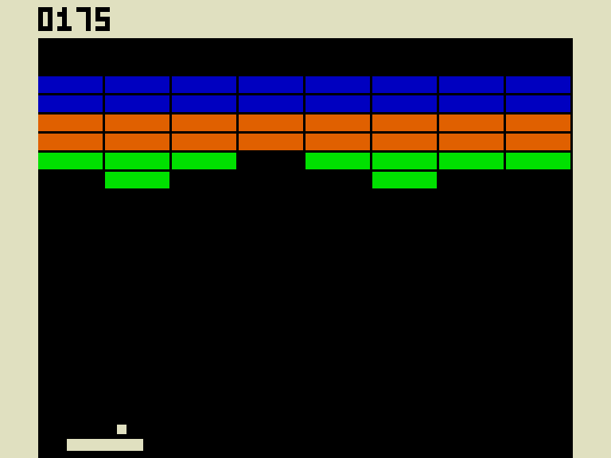

# Consolite Breakout

The arcade game Breakout written in [Consolite Assembly Language](https://github.com/rfotino/consolite-asm-cpp/blob/master/docs/assembly.md).
You can play the game by assembling it into a binary with the
[Consolite Assembler](https://github.com/rfotino/consolite-asm-cpp)
and running it with the [Consolite Emulator](https://github.com/rfotino/consolite-emu-cpp).

## Gameplay

The player starts with the ball on their paddle and they can move the
paddle left and right. Once the player hits the spacebar, the ball is
released in a random direction, all of the bricks are regenerated, and
the player's score goes back to zero. The ball bounces off of the walls,
bricks, and the paddle. When the ball bounces off of the paddle, it
bounces more to the left if it hits the paddle on the left side and
more to the right if it hits the paddle on the right side, which allows
a skilled player to aim. If the ball gets past the paddle the game is
over. Green bricks are worth 25 points, orange bricks are worth 50 points,
and blue bricks are worth 100 points. The ball speeds up once you hit the
first orange brick and then again once you hit the first blue brick. If
you manage to get all of the bricks, none more will be generated but you
will have achieved the maximum score of 2800 points.
